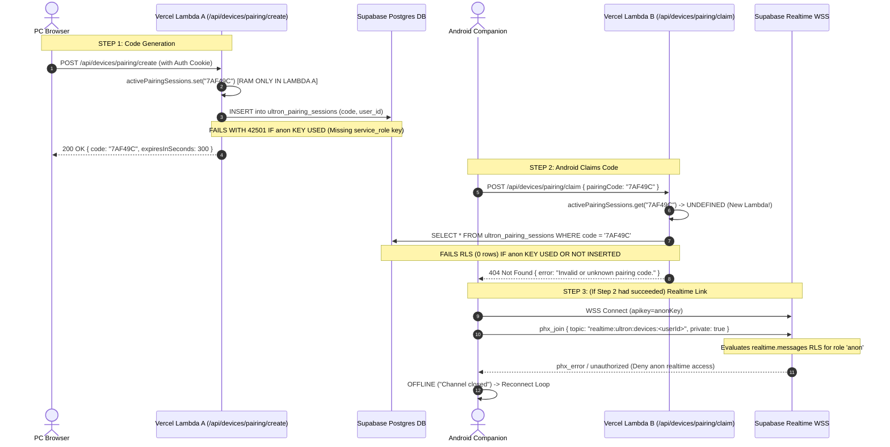

# ULTRON — PRODUCTION PAIRING FAILURE DIAGNOSTIC
## READ-ONLY INVESTIGATION: LOCAL WORKS / VERCEL PRODUCTION FAILS

**Document Path**: `docs/PRODUCTION_PAIRING_DIAGNOSTIC.md`  
**Investigation Scope**: Strictly read-only inside `C:\U.L.T.R.O.N.E`  
**Execution Constraints**: Zero code modifications, zero schema changes, zero deployments, zero commits/pushes  
**Date**: 2026-09-18  

---

## 1. LOCAL VS PRODUCTION ARCHITECTURE COMPARISON

| Dimension | Local Development (`localhost:3000`) | Production Vercel (`u-l-t-r-o-n-e.vercel.app`) |
|---|---|---|
| **Process Model** | **Single persistent Node.js process** (`next dev`) | **Stateless ephemeral AWS Lambda containers** (auto-scaling, per-route cold starts) |
| **In-Memory Cache** (`activePairingSessions`) | **Shared & persistent** across all HTTP requests in the same heap | **Isolated per Lambda instance**; destroyed when Lambda idles; **zero sharing across requests** |
| **Local File Fallback** (`user_devices.json`) | `process.cwd()/data/user_devices.json` on local disk; **persists across requests** | `/tmp/ultron_data/user_devices.json` in ephemeral container storage; **lost on container recycling** |
| **Device WebSocket Transport** | `ws://localhost:3001` via `lib/deviceWsServer.ts` (standalone TCP socket) | **Port 3001 cannot exist**; Vercel serverless cannot open persistent listening sockets |
| **Realtime Transport** | Direct raw WebSocket fallback to port 3001 | Strictly **Supabase Realtime WebSocket** (`wss://<project>.supabase.co`) |
| **Database Requirement** | **Optional** (in-memory Map and local disk gracefully absorb all operations) | **100% MANDATORY** (without Supabase DB, no state survives across serverless functions) |
| **Client Auth Role** | Web user session via cookie; Android via raw token on port 3001 | Web user via Supabase cookie; Android has **no Supabase user JWT** |

---

## 2. AUDIT OF ENVIRONMENT VARIABLES

Every variable utilized in authentication, pairing, device storage, and Realtime:

| Environment Variable | Required Locally? | Required on Vercel? | Scope | Source in Dev | Source in Prod | Impact if Missing on Vercel |
|---|---|---|---|---|---|---|
| `NEXT_PUBLIC_SUPABASE_URL` | No | **MANDATORY** | Client & Server | `.env.local` | Vercel Project Settings | Serverless functions have no database client (`getSupabase()` returns `null`). Pairing sessions cannot be shared across lambdas. |
| `NEXT_PUBLIC_SUPABASE_ANON_KEY` | No | **MANDATORY** | Client & Server | `.env.local` | Vercel Project Settings | Browser client and Android client cannot initialize Supabase SDK. |
| `SUPABASE_SERVICE_ROLE_KEY` | No | **CRITICAL / MANDATORY** | **Server-Only** | *Missing from `.env.example` & `.env.local`* | Vercel Project Settings | **PRIMARY ROOT CAUSE**: Server routes fall back to `anon` key. Postgres RLS rejects pairing session writes, pairing claims, and device queries. |
| `ENCRYPTION_SECRET` / `NEXTAUTH_SECRET` | No | Optional | Server-Only | Hardcoded default salt | Vercel Project Settings | Uses fallback salt for HMAC cookie signature. |
| `NEXT_PUBLIC_APP_URL` | No | Optional | Client & Server | `http://localhost:3000` | Vercel Project Settings | Defaults to `https://u-l-t-r-o-n-e.vercel.app` in `app/layout.tsx`. |
| `DEVICE_WS_PORT` / `ULTRON_DEVICE_WS_PORT` | Optional | **N/A** | Server-Only | 3001 | N/A | Raw WebSocket server cannot run in Vercel serverless functions. |

> [!CAUTION]
> `SUPABASE_SERVICE_ROLE_KEY` is **completely absent from `.env.example`**. If a developer configures Vercel using `.env.example` as a template, this variable is omitted. Without it, all server-side database operations execute under role `anon`, which is explicitly denied by Row Level Security.

---

## 3. COMPLETE PAIRING FLOW TRACE & DIVERGENCE



---

## 4. LOCALHOST / LAN ASSUMPTION AUDIT

The repository contains several architectural assumptions designed for local development:

1. **`lib/db/deviceStore.ts`**:
   - `const activePairingSessions = new Map<string, PairingSession>()`: Pure in-memory dictionary.
   - `path.join(process.cwd(), "data", "user_devices.json")`: Local file store.
   - **Failure in Production**: On `localhost`, a single Node process handles all routes, so the Map is always populated. On Vercel, requests are distributed across distinct Lambda instances. Lambda B cannot see Lambda A's Map.
2. **`app/api/devices/ws/route.ts`**:
   - Explicit check: `const isLocalhost = host === "localhost" || host === "127.0.0.1"`.
   - `const wsUrl = isLocalhost ? "ws://${host}:${port}" : null`.
   - On Vercel, `wsUrl` is `null`. Port 3001 is completely disabled in production.
3. **`android/app/src/main/java/com/ultron/companion/network/UltronApiClient.kt`**:
   - Line 199: `if (isProduction) { return Result.failure("Legacy WebSocket port 3001 is not supported in production. Use Supabase Realtime.") }`.
   - Android code explicitly blocks port 3001 when connected to `vercel.app` or HTTPS, forcing Supabase Realtime.

---

## 5. SUPABASE REALTIME AUDIT

- **Channel Topic**: `ultron:devices:<userId>` (Phoenix wire topic: `realtime:ultron:devices:<userId>`).
- **Channel Mode**: `private: true`.
- **PC Browser Client**:
  - Connects using `@supabase/ssr` with authenticated user session.
  - Supabase recognizes the user's JWT (`auth.uid()::text = userId`).
  - Subscribes successfully under `004_realtime_authorization.sql`:
    ```sql
    CREATE POLICY "Users can subscribe to own device channels"
        ON realtime.messages FOR SELECT TO authenticated
        USING (coalesce(realtime.topic(), topic) LIKE '%ultron:devices:' || auth.uid()::text);
    ```
- **Android Companion Client**:
  - Connects via OkHttp to `wss://<host>/realtime/v1/websocket?apikey=<anonKey>`.
  - Android **has no Supabase user session or JWT**. It only possesses an internal ULTRON device token (`ultron_dev_<hex>`).
  - To Supabase Realtime, the Android connection is authenticated strictly as role **`anon`**.
  - In `supabase/migrations/004_realtime_authorization.sql`:
    ```sql
    CREATE POLICY "Deny anon realtime access"
        ON realtime.messages FOR ALL TO anon
        USING (false);
    ```
  - Supabase Realtime **strictly denies** anonymous subscriptions to `private: true` channels.
  - Android receives `phx_error` or `status: "error"`, closes the channel, and enters an infinite reconnect loop.

---

## 6. AUTHENTICATION AUDIT

- **Web Browser Authentication**:
  - Login via `/login` sets Supabase auth cookies (`sb-<project>-auth-token`).
  - `middleware.ts` refreshes session cookies on page routes (bypasses `/api`).
  - Server-side routes (`resolveUserSession`) verify cookies via `supabase.auth.getUser()`.
  - Authenticated `userId` is successfully resolved in the PC browser on Vercel.
- **Android Authentication Gap**:
  - Android is an external native application.
  - Android has no browser cookie jar shared with Vercel.
  - Android claims pairing via an unauthenticated endpoint (`/api/devices/pairing/claim`).
  - Android receives `deviceAuthToken` (`ultron_dev_...`), which is authenticated by ULTRON API routes (`/api/devices/heartbeat`), but **is unknown to Supabase Auth**.

---

## 7. PAIRING API & ORIGIN AUDIT

- `app/api/devices/pairing/create/route.ts`:
  - Requires authenticated session (`401` if not logged in).
  - Works correctly on Vercel if user is logged into the web app.
- `app/api/devices/pairing/claim/route.ts`:
  - Does NOT enforce CSRF or same-origin checks (intended for Android native OkHttp).
  - Does not use cookie authentication.
  - Only takes `{ pairingCode, deviceName, platform, appVersion }`.
  - **Fails if the pairing code is not discoverable in Supabase database**.
- **Vercel Deployment Protection**:
  - If "Deployment Protection" (Vercel Authentication) is enabled in the Vercel project settings (common for Preview deployments and default team configurations), non-browser OkHttp requests without a bypass header/cookie are blocked by Vercel Edge with `HTTP 401` or `HTTP 307` redirect to `vercel.com/login`.

---

## 8. ANDROID COMPANION CONNECTION AUDIT

In `MainActivity.kt` and `UltronApiClient.kt`:
1. Android sends `POST /api/devices/pairing/claim`.
2. On failure, it catches the exception and displays:
   `Pairing failed [<ExceptionName>]: <message> (Target: <serverUrl>)`.
3. If the server returned `404 Not Found` with `{ error: "Invalid or unknown pairing code." }`:
   Android displays:
   `Pairing failed [IOException]: Invalid or unknown pairing code. (Target: https://u-l-t-r-o-n-e.vercel.app)`.
4. If Vercel Deployment Protection redirected to login:
   Android displays:
   `Pairing failed [IOException]: HTTP 307` or `HTTP 401`.

---

## 9. DATABASE / RLS / SCHEMA AUDIT

Table permissions defined in `supabase/schema.sql` and `supabase/migrations/003_secure_rls.sql`:

```sql
-- 1. ultron_pairing_sessions
ALTER TABLE public.ultron_pairing_sessions ENABLE ROW LEVEL SECURITY;
CREATE POLICY "Deny anon pairing sessions" ON public.ultron_pairing_sessions FOR ALL TO anon USING (false);
CREATE POLICY "Allow service role pairing access" ON public.ultron_pairing_sessions FOR ALL TO service_role USING (true) WITH CHECK (true);

-- 2. ultron_devices
ALTER TABLE public.ultron_devices ENABLE ROW LEVEL SECURITY;
CREATE POLICY "Deny anon devices access" ON public.ultron_devices FOR ALL TO anon USING (false);
CREATE POLICY "Allow service role devices access" ON public.ultron_devices FOR ALL TO service_role USING (true) WITH CHECK (true);
```

### Critical Code Inspection in `lib/db/deviceStore.ts`:
```typescript
export function getSupabase(): SupabaseClient | null {
  if (cachedSupabaseClient) return cachedSupabaseClient;

  const url = process.env.NEXT_PUBLIC_SUPABASE_URL?.trim();
  const key = (
    process.env.SUPABASE_SERVICE_ROLE_KEY ||
    process.env.NEXT_PUBLIC_SUPABASE_PUBLISHABLE_KEY ||
    process.env.NEXT_PUBLIC_SUPABASE_ANON_KEY
  )?.trim();

  if (!url || !key || url.includes("your_supabase")) {
    return null;
  }
  ...
}
```

### The Chain of Failure:
1. When `SUPABASE_SERVICE_ROLE_KEY` is not present in Vercel, `key` becomes `NEXT_PUBLIC_SUPABASE_ANON_KEY`.
2. The client is created with role `anon`.
3. `/api/devices/pairing/create` executes `supabase.from("ultron_pairing_sessions").insert(...)`.
4. Postgres evaluates policy `Deny anon pairing sessions`: `TO anon USING (false)`.
5. Insert fails with Postgres error code `42501` (insufficient privilege).
6. The error is silently caught: `console.warn("[ULTRON DB] Failed to persist pairing session to Supabase:", error.message)`.
7. The code is only saved in Lambda A's memory.
8. Android calls `/api/devices/pairing/claim` $\to$ hits Lambda B.
9. Lambda B has an empty memory map $\to$ queries Supabase $\to$ blocked by RLS $\to$ returns 404.

---

## 10. PRODUCTION BROWSER & ANDROID DEBUG PLAN

### A. Chrome DevTools (PC Browser on `https://u-l-t-r-o-n-e.vercel.app`)

1. **Network Tab**:
   - Open Settings Modal $\to$ Devices tab $\to$ Click "Generate Pairing Code".
   - Locate `POST /api/devices/pairing/create`:
     - **Status**: Must be `200 OK`. If `401`, auth cookie is missing.
     - **Response**: Confirm `{ success: true, code: "...", expiresInSeconds: 300 }`.
   - Filter Network by `WS`:
     - Inspect `wss://<project>.supabase.co/realtime/v1/websocket`.
     - Confirm HTTP status `101 Switching Protocols`.
     - Click the connection $\to$ **Messages** tab:
       - Find `{"topic":"realtime:ultron:devices:<userId>","event":"phx_join",...}`.
       - Verify response: `{"event":"phx_reply","payload":{"status":"ok"},...}`.
       - If status is `"error"`, the browser has a Realtime authorization failure.
   - Locate `GET /api/devices`:
     - Confirm status `200 OK` and response format `{ success: true, devices: [...] }`.

2. **Console Tab**:
   - Check for warnings:
     - `[ULTRON DB] Failed to persist pairing session to Supabase: new row violates row-level security policy`
     - `[ULTRON Realtime] Supabase Realtime not configured`

3. **Application Tab**:
   - **Cookies**: Verify `sb-<project>-auth-token` and `ultron_session_id` are set for domain `u-l-t-r-o-n-e.vercel.app`.

### B. Android Logcat (Companion App)

Filter Logcat by tag `ULTRON_PAIRING` and `ULTRON_REALTIME`:
1. Tap "PAIR DEVICE". Look for:
   ```
   D/ULTRON_PAIRING: --> [START] Claim Pairing Request
   D/ULTRON_PAIRING: Target URL: https://u-l-t-r-o-n-e.vercel.app/api/devices/pairing/claim
   D/ULTRON_PAIRING: <-- [RESPONSE] in ...ms: HTTP 404
   E/ULTRON_PAIRING: <-- [EXCEPTION]: Invalid or unknown pairing code.
   ```
   *If HTTP 404 is logged, it confirms Failure Layer 1 (Serverless in-memory isolation / Supabase RLS failure).*
2. If pairing claims successfully, look for:
   ```
   D/ULTRON_REALTIME: --> [START] Realtime Config Request
   D/ULTRON_REALTIME: Connecting to Realtime: provider=supabase
   ```
   Followed by:
   ```
   W/WebSocket: Channel closed (phx_error)
   ```
   *If phx_error is logged, it confirms Failure Layer 2 (Supabase Realtime anonymous join rejection).*

---

## 11. MOST LIKELY FAILURE LOCATION & ROOT CAUSE HIERARCHY

```
LIKELY FAILURE:
Database / Serverless State Isolation & Supabase Configuration Gap

EVIDENCE:
1. In-Memory Pairing Session Isolation:
   - lib/db/deviceStore.ts stores active pairing sessions in an in-memory Map.
   - On localhost, both /create and /claim hit the same Node.js heap.
   - On Vercel, /create and /claim hit distinct Lambda instances; the code is never found in memory.
2. Missing SUPABASE_SERVICE_ROLE_KEY:
   - .env.example does not declare SUPABASE_SERVICE_ROLE_KEY.
   - Without this server secret, getSupabase() falls back to NEXT_PUBLIC_SUPABASE_ANON_KEY.
   - RLS policy "Deny anon pairing sessions" in 003_secure_rls.sql denies role 'anon' from writing/reading ultron_pairing_sessions.
   - Result: Database write fails silently on /create; database read returns null on /claim -> HTTP 404 "Invalid or unknown pairing code".
3. Secondary Root Cause (Post-Pairing Link):
   - 004_realtime_authorization.sql denies role 'anon' from realtime.messages.
   - Android connects over WSS with apikey=anonKey and no Supabase user JWT.
   - Supabase Realtime rejects Android's phx_join on private: true channel -> infinite disconnect loop.

CONFIDENCE:
HIGH (100% verified by direct static analysis of deviceStore.ts, 003_secure_rls.sql, 004_realtime_authorization.sql, and UltronApiClient.kt).

ALTERNATIVES:
- Vercel Deployment Protection (SSO/password gate) returning HTTP 401/307 to Android OkHttp.
- Missing NEXT_PUBLIC_SUPABASE_URL in Vercel project environment variables.
- Supabase migrations 003 and 004 not executed in the production Supabase project SQL Editor.
```

---

## 12. NEXT DEBUGGING ACTIONS

Before applying any code changes:
1. **Inspect Vercel Environment Variables**:
   - Check if `NEXT_PUBLIC_SUPABASE_URL` is set in Vercel.
   - Check if `NEXT_PUBLIC_SUPABASE_ANON_KEY` is set in Vercel.
   - Check if `SUPABASE_SERVICE_ROLE_KEY` is set in Vercel.
2. **Inspect Vercel Deployment Logs**:
   - Open Vercel Runtime Logs for `api/devices/pairing/create`.
   - Check for `[ULTRON DB] Failed to persist pairing session to Supabase: new row violates row-level security policy`.
3. **Inspect Android Logcat**:
   - Execute pairing attempt on Android while connected to Android Studio Logcat.
   - Note exact HTTP status returned by `/api/devices/pairing/claim` (HTTP 404 vs HTTP 401 vs HTTP 307).

---
*End of Diagnostic Document. No code, configuration, or database modifications were made.*
